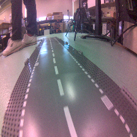
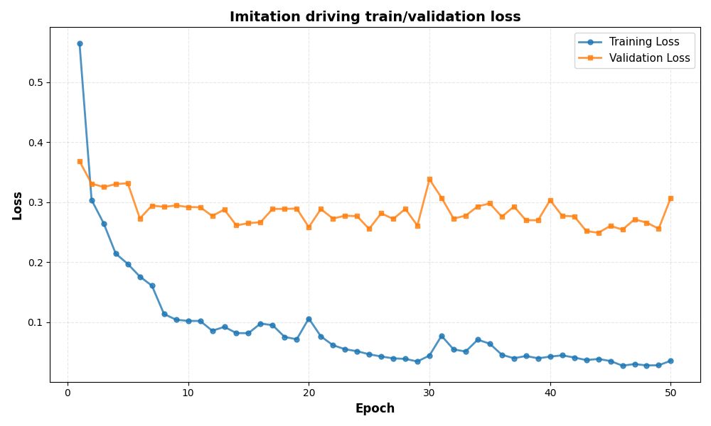
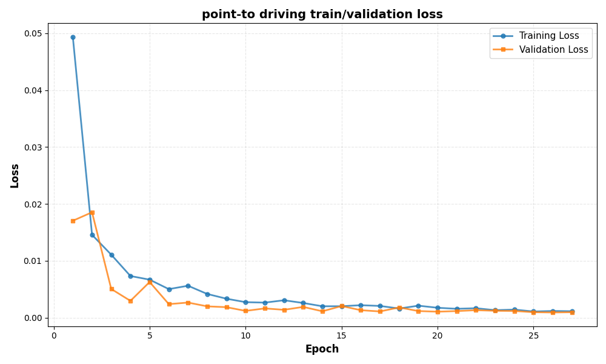
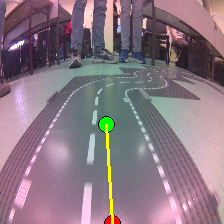

# Jetbot autonomous driving project

### Overview

This project aimed at building an autonomous driving system for a Jetbot using deep learning techniques. The system is designed to navigate through simple car tracks by processing camera input and making real-time driving decisions.

**Figure 1:** Our jetbot in action on a test track, demonstrating its ability to follow the path autonomously.

**Figure 2:** Example input from the Jetbot's camera

### Data Collection

To train our model, we collected data by manually driving the Jetbot around the track while recording the camera feed and corresponding steering commands. This dataset was then used to train a our first approach, a convolutional neural network (CNN) that takes the camera input and predicts the steering angle.

For our second approach, to-point-driving, we manually annotated a dataset with target points on the track and trained a model to predict the next target point based on the current camera input. For annotation we used script available in `src/data_methods/data_processing/to_point_driving/label_images_custom.ipynb`.

## Data preprocessing

### All models

In both approaches, we first filtered out images that were not useful for training, such as those where jetbot stayed out of track or where jetbot was standing still.

Also during training, all models were additionally augmented by random color jittering to ensure better generalization and robustness to different lighting conditions. This was done using `torchvision.transforms.ColorJitter` with parameters `brightness=0.2`, `contrast=0.2`, `saturation=0.2`, and `hue=0.1`.

### Imitation driving

Our preprocessing pipeline for the imitation driving approach includes the following steps:
- in `csv_preprocess.py` we concate all the csv files with controler inputs and shift them by 1 frame, as original 10fps recording was pairing frames with old controller inputs, which would make training impossible.
- in `images_preprocess.py` we place all the images in a single directory and ensure their names are consistent with csv (they have to have the same number of digits in decimal part for efficient pairing csv row <-> image, but by default they don't)
- in `sync_images_csv.py` we remove images without matching row in csv and remove rows in csv without an image.
- Finally, in `data_inspection_steering.ipynb` we mirror each image with respect to y axis and flip its steering value. This way we have 2x larger dataset 2*1948=3896 images with controler data, which enhances the model's ability to generalize and handle various driving scenarios.

### To-point-driving

Well, as points were annotated manually, there is no additional scripts. all of the data is already preprocessed and ready for training. The only need was to manually remove images where jetbot was out of track or standing still, but that was done during annotation process, so no additional scripts were needed for that.

## Model Architecture

### to-point driving

Our CNN architecture for the to-point driving approach was directly taken from the [NVIDIA Jetbot repository tutorial on road_following](https://github.com/NVIDIA-AI-IOT/jetbot/tree/master/notebooks/road_following).

The model consists of a pretrained backbone network (originally ResNet18, but due to high latency we switched to MobileNetV3) followed by a fully connected layer that outputs the x and y coordinates of the target point. The model was trained using mean squared error loss between the predicted and actual target points.

### Imitation driving

For the imitation driving approach, we used a similar CNN architecture, but instead of predicting target points, the output layer was designed to predict the steering angle directly. The model was trained using mean squared error loss between the predicted steering angle and the actual steering angle from the dataset.

## Training and Evaluation

Both models were trained using the Adam optimizer with a learning rate of 0.001/0.0005 and a batch size of 32. We trained for 50 epochs, monitoring the training and validation loss to ensure that the model was learning effectively without overfitting. To ensure proper training, we split our dataset into training and validation sets, using an 80-20 split.

**Figure 4:** We can see that loss during training is decreasing, which indicates that the model is learning to predict steering angles based on the camera input. The validation loss is suprisingly staying almost the same, which may indicate that the model is not generalizing well to unseen data. However, manual checks found model predictions to be reasonable, so we decided to proceed with deployment on Jetbot and evaluate its performance in real-world conditions.

**Figure 5:** Here both training and validation losses are decreasing, which indicates that the model is learning to predict target points based on the camera input.

Before testing it on Jetbot, we evaluated the performance of both models by taking sample images from the validation set and comparing the predicted steering angles or target points with the actual values. This allowed us to verify that the models were learning to make reasonable predictions based on the camera input.

Figure 5: We can see that the predicted target point (red dot) is reasonably close to the actual target point (green dot), indicating that the model has learned to predict target points based on the camera input.

## Transformation to steering commands

- For the imitation driving model, the output is already a steering angle, so we simply need to convert it to a format that can be sent to the Jetbot's motor controller. This involves scaling the predicted steering angle to the appropriate range and sending it as a command to the motors.
- For the to-point driving model, we closely follow the approach described in the NVIDIA Jetbot repository tutorial on road_following. We calculate the angle between the current position of the Jetbot and the predicted target point, and then convert that angle into a steering command that can be sent to the motors. This involves some trigonometric calculations to determine the appropriate steering angle based on the relative position of the target point. We also tried some smoothing techniques to reduce the jitteriness of the steering commands, yet it caused to increasy latency even more, so we had to remove it in the end.

## Deployment on Jetbot

After training, we tried to deploy both models on jetbot. Sadly, due to many technical difficulties (see section "Issues encountered") we needed to convert all models to ONNX format and run them using ONNX Runtime. This conversion process was straightforward for the imitation driving model, but for the to-point driving model we had to make some adjustments to the architecture to ensure compatibility with ONNX. Sadly, even after conversion, the to-point driving still faced some issues with latency, which made it too buggy on the track to work. Luckily, the imitation driving model worked well and was able to navigate the track autonomously, demonstrating the effectiveness of our approach. 

It was able to achieve 1 lap in 18 seconds, which matched our score from manual driving.

## Issues encountered

### Lack of GPU availability

Despite jetbot formally having a GPU, we were not able to utilize it for our models due to strange deployement of our notebooks instance on jetbot. As we tried to repair it, we ended up removing pytorch from jetbot, causing a lot more issues

### Pytorch installation issues

After removing pytorch, we had to reinstall it, but due to some dependency issues, we were not able to install the correct version of pytorch that would be compatible with our models. We somehow managed to find a version that worked, but it was very old one (1.3.0), which caused some issues with our code and forced to downgrade onnx opset_version from 17 to 11. Due to that, we also needed to monkey patch some model layers (like HardSigmoid) to make them compatible with older onnx opset.

Suprisingy though it gave as access to CUDA, which we were not able to use before. Sadly, it didn't improve latency so much (only by about 10ms on imitation driving model), which made us think that the main bottleneck was not in the GPU, but rather in the CPU or in the data transfer between CPU and GPU.

### Latency issues
Even after optimizing our models and converting them to ONNX format, we still faced significant latency issues, especially with the to-point driving model. This was likely due to the complexity of the model and the limitations of the hardware on the Jetbot. Despite our efforts to optimize the model architecture and reduce latency, we were not able to achieve fair performance with the to-point driving approach, which ultimately led us to focus on the imitation driving model for deployment.

| Model    | CPU             | GPU           |
| -------- | -------         | -------       |
| Imitation | 70ms (10ms)    | 60ms (9ms)    |
| To-point  | 100ms (150ms)  | ------------* |

**Figure 7:** Latency measurements for both models on CPU and GPU. The numbers in parentheses represent standard deviations. The to-point driving model was not able to run on GPU due to compatibility issues with the older version of PyTorch (there were some problems with torchvsion and onnx conversion).

## Authors
- Oliwier Necelman
- Karol Sroka
- Igor Szymczak
